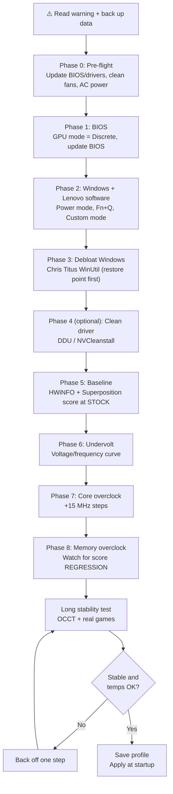
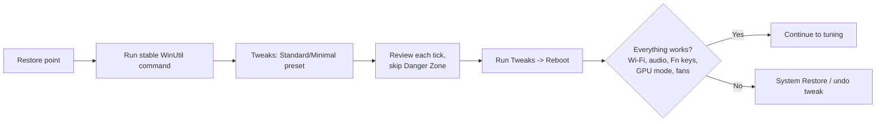
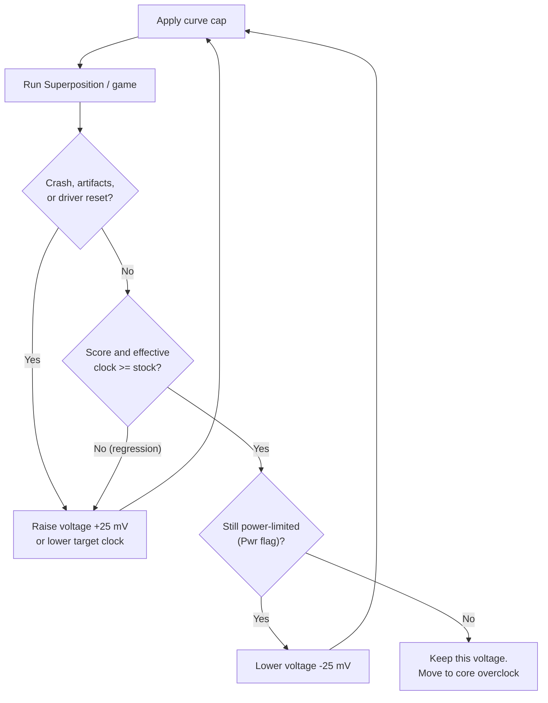

# Laptop NVIDIA GPU Tuning Guide
### Undervolt + Overclock + Windows Debloat for Gaming Laptops (Legion Pro 7i / RTX 5080 and similar)

> ## ⚠️ WARNING: USE AT YOUR OWN RISK
> Overclocking, undervolting, changing BIOS settings and running system-tweak scripts can cause **crashes, data loss, boot loops, overheating, reduced component lifespan, and may void your warranty**. Laptops are **less forgiving than desktops**: the CPU and GPU usually share one cooling assembly, the power budget is fixed by the manufacturer, and you cannot swap a failed part like a desktop card.
>
> - Nothing here is guaranteed to work on your unit. Every chip is different.
> - This guide is **not** affiliated with Lenovo, NVIDIA, MSI, Chris Titus Tech or any tool vendor.
> - Back up your data **before** you start.
> - If something feels wrong (fans screaming, temps spiking, artifacts, shutdowns), **stop and revert to stock**.
> - Check your warranty terms first. Software tuning is generally lower-risk than hardware changes, but you are responsible for your own device.

**Adapted from:** [LunarPSD/NvidiaOverclocking](https://github.com/LunarPSD/NvidiaOverclocking/blob/main/Nvidia%20Overclocking.md) (a desktop-oriented guide), rewritten for **laptops**, with BIOS/Windows setup, a Windows debloat section, diagrams and the reasoning behind each step.

---

## Table of Contents

1. [What changes on a laptop (read this first)](#1-what-changes-on-a-laptop-read-this-first)
2. [The big picture (roadmap)](#2-the-big-picture-roadmap)
3. [Software you need (with download links)](#3-software-you-need-with-download-links)
4. [Phase 0: Pre-flight checklist](#4-phase-0-pre-flight-checklist)
5. [Phase 1: BIOS settings](#5-phase-1-bios-settings)
6. [Phase 2: Windows and Lenovo software settings](#6-phase-2-windows-and-lenovo-software-settings)
7. [Phase 3: Debloat Windows with Chris Titus WinUtil](#7-phase-3-debloat-windows-with-chris-titus-winutil)
8. [Phase 4: Clean GPU driver install (optional)](#8-phase-4-clean-gpu-driver-install-optional)
9. [Phase 5: Baseline and monitoring](#9-phase-5-baseline-and-monitoring)
10. [Phase 6: Undervolting (do this first)](#10-phase-6-undervolting-do-this-first)
11. [Phase 7: Core overclock](#11-phase-7-core-overclock)
12. [Phase 8: Memory overclock](#12-phase-8-memory-overclock)
13. [Stability testing plan](#13-stability-testing-plan)
14. [Saving profiles and applying at startup](#14-saving-profiles-and-applying-at-startup)
15. [Recovery: boot loops and resets](#15-recovery-boot-loops-and-resets)
16. [What NOT to do on a laptop](#16-what-not-to-do-on-a-laptop)
17. [Cooling tips](#17-cooling-tips)
18. [Troubleshooting table](#18-troubleshooting-table)
19. [Tuning log template](#19-tuning-log-template)

---

## 1. What changes on a laptop (read this first)

The original guide is written for **desktop** cards. Several of its steps do not apply, or are unsafe, on a laptop. Here is what I changed and why.

| Topic | Desktop guide says | Laptop reality | What this guide does |
|---|---|---|---|
| **Power limit slider** | Max out power limit in Afterburner | Usually locked or missing. The laptop's total graphics power (TGP, e.g. up to 175 W on Legion Pro 7i RTX 5080) is set by firmware and modes | Use the manufacturer's **Custom/Performance mode** for power, not Afterburner |
| **Fan curve in Afterburner** | Set a custom fan curve | The embedded controller (EC) owns the fans, so Afterburner fan control usually does nothing | Use Lenovo's fan curve/Custom mode |
| **Flash a higher-power VBIOS** | Optional advanced step | Laptop VBIOS is tied to the board and power design. A wrong flash can brick the machine and there is no simple recovery | **Removed. Do not do this on a laptop** |
| **Disable ECC (Lovelace)** | Small performance gain | Desktop-card specific and marked "needs more testing" in the source | **Skipped** |
| **"You can't overclock too much"** | Voltage is locked, so it is safe | Voltage is locked, but **heat is not**. Shared heatsinks mean GPU heat raises CPU temps and vice versa | Temperature targets are stricter here |
| **Start at 900 mV** | Fixed desktop baseline | Mobile GPUs run different voltage/clock points | Find **your own** stock voltage first (Phase 6) |
| **Start memory at +500 MHz** | Tuned for GDDR6X | RTX 50 series uses GDDR7 and offsets behave differently | Start lower (+200) and step carefully |
| **Copy someone's settings** | Not advised | Still not advised, more so on laptops | Find your own numbers |

**Reality check on gains:** on a power-limited laptop, a **well-done undervolt** often gives the biggest win (lower heat, quieter fans, higher *sustained* clocks). A core/memory overclock on top typically adds a modest gain (often low single digits to roughly 10% in FPS depending on workload and cooling). Do not expect desktop-style numbers.

---

## 2. The big picture (roadmap)



**Order matters.** Baseline first (so you can prove you gained something), undervolt second (it frees power/thermal headroom), overclock last.

### Why the laptop power/thermal budget is the real limit

```
                    ┌──────────────────────────────────────────┐
   AC adapter ─────►│  TOTAL SYSTEM POWER BUDGET               │
   (400 W class on  │   (fixed by firmware + thermal mode)     │
    Legion Pro 7i)  └───────────────┬──────────────────────────┘
                                    │ shared
               ┌────────────────────┼─────────────────────┐
               ▼                    ▼                     ▼
        ┌─────────────┐      ┌─────────────┐       ┌────────────┐
        │  CPU (HX)   │      │  GPU (TGP)  │       │ Rest: RAM, │
        │  heat ▲     │      │  heat ▲     │       │ SSD, screen│
        └──────┬──────┘      └──────┬──────┘       └────────────┘
               │                    │
               └────────┬───────────┘
                        ▼
              ┌───────────────────┐
              │ SHARED heatpipes/ │   More GPU heat  →  hotter CPU
              │ vapor chamber/fans│   More CPU heat  →  hotter GPU
              └───────────────────┘
```

**Reasoning:** if the GPU is already pinned at its power limit, raising clocks does nothing; the card just throttles. Undervolting lowers watts per clock, so the same power budget sustains higher clocks. That is why undervolting comes first.

---

## 3. Software you need (with download links)

Always download from the **official site** listed. Avoid "mirror" or "cracked" download sites.

### Tuning and monitoring

| Software | Purpose | Download |
|---|---|---|
| **MSI Afterburner** (+ RivaTuner) | GPU core/memory offsets and the voltage/frequency curve editor. Works on non-MSI laptops. Use the **latest** version so RTX 50 series is recognised | https://www.msi.com/Landing/afterburner/graphics-cards |
| **HWiNFO64** | Sensor monitoring (temps, power, throttle flags). Run in **Sensors-only** mode | https://www.hwinfo.com/download/ |
| **GPU-Z** | Confirms GPU model, driver, clocks, and PerfCap reason | https://www.techpowerup.com/download/techpowerup-gpu-z/ |
| **OCCT** | Stability stress test with error detection | https://www.ocbase.com/download |

### Benchmarks

| Software | Use | Download |
|---|---|---|
| **Unigine Superposition** | Best for consistent scores. Detects memory-OC regressions | https://benchmark.unigine.com/superposition |
| **3DMark** (Time Spy) | Stability + score. Free demo exists; the looping *Stress Test* needs a paid edition | https://store.steampowered.com/app/223850/3DMark/ |
| **Your own games** | The most realistic stress test | n/a |

### Lenovo / Legion specific

| Software | Purpose | Download |
|---|---|---|
| **Lenovo Vantage** and/or **Legion Zone / Legion Space** (name varies by generation) | Thermal modes, Custom mode, GPU mode switching, some models expose GPU overclock | Microsoft Store, or https://support.lenovo.com (search your exact model) |
| **Lenovo BIOS/EC updates** | Firmware fixes (some improve GPU features and thermals) | https://support.lenovo.com → your model → Drivers & Software → BIOS |
| **Legion Toolkit** (community, open source, optional) | Lightweight alternative to Lenovo's heavier apps for power mode / GPU mode | https://github.com/BartoszCichecki/LenovoLegionToolkit |

### System and driver tools

| Software | Purpose | Download |
|---|---|---|
| **NVIDIA driver** | Official GPU driver | https://www.nvidia.com/Download/index.aspx |
| **Chris Titus WinUtil** | Windows debloat / tweaks / installer (no download, runs from PowerShell) | https://github.com/ChrisTitusTech/winutil |
| **DDU** (Display Driver Uninstaller) | Fully remove GPU drivers before a clean install | https://www.guru3d.com/files-details/display-driver-uninstaller-download.html |
| **NVCleanstall** | Slimmer NVIDIA driver installs | https://www.techpowerup.com/download/techpowerup-nvcleanstall/ |

> **Not recommended for laptops:** NVFlash / VBIOS flashing, Furmark, Kombustor. See [Section 16](#16-what-not-to-do-on-a-laptop).

---

## 4. Phase 0: Pre-flight checklist

Do all of these **before** touching any setting.

- [ ] **Back up** important files (cloud or external drive).
- [ ] **Plug in the original charger.** Never tune on battery, and never use a lower-wattage third-party adapter. (Legion Pro 7i Gen 10 ships with a very high-wattage adapter for a reason.)
- [ ] **Hard surface, good airflow.** Not a bed, couch or lap. A laptop stand helps.
- [ ] **Blow out dust** from the vents with compressed air (short bursts, laptop powered off).
- [ ] **Update BIOS/EC** from Lenovo's support page (Section 5).
- [ ] **Update Windows** and the **NVIDIA driver**.
- [ ] **Note your stock settings** (screenshot Lenovo software and Afterburner defaults).
- [ ] **Create a Windows restore point** (Start → "Create a restore point" → *System Protection* → *Create*).
- [ ] Know how to reach **Safe Mode** (Section 15) *before* you need it.

---

## 5. Phase 1: BIOS settings

Lenovo laptops keep the BIOS deliberately simple. **Do not unlock hidden "advanced" BIOS menus** using community tricks; they expose settings that can brick or destabilise the machine.

### How to enter the BIOS

1. Shut down fully.
2. Power on and **tap `F2` repeatedly** (or use the **Novo button**, a small button/pinhole beside the power area, then choose **BIOS Setup**).
3. Navigate with arrow keys; `F10` saves and exits.

### What to check

| BIOS / firmware item | Where (typical Legion) | Recommended | Why |
|---|---|---|---|
| **BIOS version** | Main / Information | Update to the newest from Lenovo support | Fixes thermal, GPU and stability bugs. Some features (e.g. G-SYNC on certain models) arrived through BIOS updates |
| **GPU Working Mode** (Hybrid / Discrete / Hybrid-iGPU) | Configuration (also switchable in Lenovo software) | **Discrete GPU** for max performance and tuning; **Hybrid** for daily battery use | Discrete uses the MUX switch to connect the display directly to the NVIDIA GPU, avoiding the iGPU hop. Changing it requires a reboot. Models with Advanced Optimus may switch dynamically |
| **Secure Boot** | Security | Leave **enabled** unless you have a specific reason | Not needed to be off for anything in this guide |
| **Virtualization / TPM** | Configuration / Security | Leave defaults | Windows 11 wants TPM; no tuning benefit from changing |
| **Overclocking / advanced CPU menus** | Often hidden | **Leave alone** | CPU tuning is out of scope, and the CPU shares the cooler with the GPU |

> **Menu names differ by model and BIOS version.** If you cannot find an item, don't hunt for hidden menus. Use Lenovo's software instead (Section 6).

---

## 6. Phase 2: Windows and Lenovo software settings

### 6.1 Windows settings

| Setting | Path | Value | Why |
|---|---|---|---|
| **Power mode** | Settings → System → Power & battery → Power mode | **Best performance** (plugged in) | Prevents Windows from limiting boost |
| **Game Mode** | Settings → Gaming → Game Mode | On | Prioritises the game process |
| **Graphics preference** | Settings → System → Display → Graphics | Set demanding apps/games to **High performance** | Forces the NVIDIA GPU |
| **Hardware-accelerated GPU scheduling** | Settings → System → Display → Graphics → Default graphics settings | Leave at default; test on/off only if you see stutter | Effects vary by game |
| **NVIDIA power management** (testing only) | NVIDIA Control Panel / NVIDIA app → 3D settings → Power management mode | *Prefer maximum performance* while benchmarking | Prevents clock dips confusing your tests |

### 6.2 Lenovo thermal modes (Fn + Q)

Press **Fn + Q** to cycle modes. The power LED colour indicates the mode.

| Mode | LED | Behaviour |
|---|---|---|
| Quiet | Blue | Low power/noise |
| Balanced | White | Default compromise |
| Performance | Red | Higher CPU/GPU power and fan speed |
| **Custom** | Purple | You set power limits and fan curve (where the model exposes it) |

**For tuning:** use **Performance** (or **Custom** with a strong fan curve). You need a **fixed** thermal mode so results are comparable from run to run.

### 6.3 Lenovo Vantage / Legion Zone / Legion Space

Open the gaming hub app that came with your laptop and look for:

- **Custom mode** → CPU/GPU power limits, fan curve. Raise fans to a level you can tolerate. Cooler = higher, steadier clocks.
- **GPU mode / Hybrid mode** toggle.
- **GPU Overclock** (core/memory offsets), *if your model exposes it.* Use **either** Lenovo's OC **or** Afterburner, not both at the same time.
- **AI Engine / auto-optimisation**: **turn it OFF while tuning.** It changes power limits dynamically, which makes your test results inconsistent. You can turn it back on afterwards.

> **Reasoning:** you can't tell whether a change helped if the system is silently changing limits in the background. Freeze every variable except the one you are testing.

---

## 7. Phase 3: Debloat Windows with Chris Titus WinUtil

**What it is:** [WinUtil](https://github.com/ChrisTitusTech/winutil) is an open-source PowerShell tool that installs apps, applies privacy/performance tweaks, fixes and configures Windows features, and manages updates.

**Why debloat for tuning?** Less background CPU/disk/network activity means fewer random spikes during benchmarks and a slightly cooler, quieter machine. It is not a big FPS boost by itself, but it makes testing cleaner.

> ### ⚠️ Read before you run it
> - It **runs a script from the internet with administrator rights.** Review the code first at https://github.com/ChrisTitusTech/winutil (or only run it from the official repo/domain).
> - It makes **system-wide changes.** Windows Security may flag it (it's a false-positive-style detection because of the changes it makes).
> - **Always create a restore point first.**
> - Apply tweaks **one category at a time** and reboot, so you know what caused a problem.

### 7.1 Step by step

1. **Create a restore point** (Start → *Create a restore point* → Create).
2. **Open PowerShell as Administrator:**
   - Right-click Start → **Terminal (Admin)** (Windows 11) or **Windows PowerShell (Admin)** (Windows 10), *or*
   - Press Windows key, type `PowerShell`, press **Ctrl + Shift + Enter**.
3. **Run the stable launch command:**
   ```powershell
   irm "https://christitus.com/win" | iex
   ```
   *Can't reach the site, or DNS/region issue?* Run it from GitHub instead (replace `RELEASE_TAG` with a current release tag from the repo's Releases page):
   ```powershell
   irm "https://github.com/ChrisTitusTech/winutil/releases/download/RELEASE_TAG/winutil.ps1" | iex
   ```
4. The WinUtil window opens. Main tabs: **Install**, **Tweaks**, **Config**, **Updates** (and **MicroWin** for building slim install images).
5. **Tweaks tab:**
   1. Tick **Create Restore Point** and run it first.
   2. Choose the **Standard** (or **Minimal**) preset as a starting point, then **review every ticked item** (see table below).
   3. Click **Run Tweaks** and wait for the "Tweaks are Finished" message.
   4. **Reboot.**
6. **Config tab:** only enable Windows features you actually use. Don't remove things you don't understand.
7. **Updates tab:** pick **Security (Recommended)** or leave **Default**. Avoid "disable all updates", because missing security patches is a real risk.

### 7.2 What to tick, what to avoid (laptop-safe choices)

Tweak names shift between WinUtil releases. Treat this as guidance by *category*.

| Tweak category | Verdict | Notes |
|---|---|---|
| Create Restore Point | ✅ **Do first** | Your undo button |
| Delete temporary files / disk cleanup | ✅ Safe | Frees space |
| Disable telemetry / consumer features / activity history / location tracking | ✅ Safe | Privacy + fewer background tasks |
| Disable GameDVR / background recording | ✅ Usually good | Removes capture overhead. Don't do it if you use Xbox Game Bar capture |
| Set services to **Manual** | ⚠️ OK **with care** | Fine for Windows services, but **do not disable Lenovo/Legion services** (they run Fn+Q modes, fan control, GPU mode switching) |
| Disable hibernation | ⚠️ Optional | Only if you don't use hibernate or Fast Startup |
| Remove OneDrive / Edge / Copilot-type items | ⚠️ Only if you're sure | Can break sign-in, syncing or other apps |
| "Advanced / Danger Zone" tweaks (e.g. network or service hardening, disabling notifications) | ❌ **Skip** | Higher chance of side effects; no benefit for GPU tuning |
| Disable Windows Update entirely | ❌ **Skip** | Security risk |
| Anything touching **NVIDIA or Lenovo services/drivers** | ❌ **Skip** | Can break GPU switching, thermal control, G-SYNC |

### 7.3 If something breaks

- Open **Start → Create a restore point → System Restore** and roll back to the point you made.
- WinUtil's tweaks include "undo" options; untick the tweak and run again to revert.
- Reboot after each change so effects are visible.



---

## 8. Phase 4: Clean GPU driver install (optional)

Only do this if you suspect driver problems, or want a slimmer install. **Skip it if your system is stable.**

> **Laptop caution:** Lenovo/NVIDIA laptop drivers include components for GPU switching and G-SYNC. If you slim the driver with NVCleanstall, **keep the defaults for anything display-related**. Don't remove things "just because".

1. Download the latest [NVIDIA driver](https://www.nvidia.com/Download/index.aspx), [DDU](https://www.guru3d.com/files-details/display-driver-uninstaller-download.html) and (optionally) [NVCleanstall](https://www.techpowerup.com/download/techpowerup-nvcleanstall/).
2. **Disconnect from the internet** (Wi-Fi off) so Windows doesn't auto-install a driver.
3. Boot to **Safe Mode**: hold `Shift` + click **Restart** → Troubleshoot → Advanced options → Startup Settings → Restart → press `4`.
4. Run **DDU** → device type **GPU** → *Clean and restart*.
5. Boot normally, run the driver installer (or NVCleanstall using "use driver files on disk"). In NVCleanstall, leave essentials checked, keep **HD Audio** if you use HDMI/USB-C audio, and enable **Disable Installer Telemetry & Advertising** if offered.
6. Reconnect to the internet.

---

## 9. Phase 5: Baseline and monitoring

**You need numbers from stock settings.** Without them you can't prove any change helped.

### 9.1 Set up monitoring

1. Launch **HWiNFO64** → choose **Sensors-only** → Run.
2. Pin these sensors (right-click → *Show in tray* or just watch the list):
   - GPU Temperature (and Hot Spot / Memory Junction if shown)
   - GPU Power, GPU Core Voltage
   - GPU Clock and **GPU Effective Clock**
   - **GPU Performance Limit** flags (table below)
   - CPU Package Power and CPU Package Temp
   - Fan RPMs
3. Launch **MSI Afterburner** and (optional) enable the on-screen display.

### 9.2 Understanding throttle flags

| Flag in HWiNFO | Meaning | What to do |
|---|---|---|
| **Power (Pwr)** | GPU hit its power limit and slowed down | Undervolt / lower voltage |
| **Thermal (Thrm)** | Hit temperature limit | More cooling, lower voltage, back off OC |
| **Reliability Voltage (vRel)** | Voltage too high for the current temperature | Lower voltage |
| **Max Operating Voltage (VOp)** | Hit the VBIOS voltage cap | Normal at the top of the curve |
| **Utilization (Util)** | GPU not under full load | Not a limit; the test isn't heavy enough |

### 9.3 Record your stock baseline

Run **each once at stock** (Performance mode, plugged in, fans as you'll use them) and write down:

| Test | What to record |
|---|---|
| Superposition (preset that fills VRAM without exceeding it) | Score, average GPU temp, average GPU power, average clock |
| 3DMark Time Spy | Graphics score |
| One favourite game (same scene each time) | Average FPS, GPU temp, GPU power |

### 9.4 Laptop temperature targets (conservative)

These are **conservative targets I recommend, not vendor limits.** Your laptop may safely run hotter at stock; the goal is not to *add* heat beyond what the cooling handles.

| Sensor | Target under sustained load |
|---|---|
| GPU core | Ideally ≤ ~80 °C |
| GPU hot spot / memory junction (if shown) | Keep comfortably below ~90 °C |
| CPU package | Watch it. The GPU load will raise it. Stock Arrow Lake HX chips can already run very hot in some laptops |

---

## 10. Phase 6: Undervolting (do this first)

### 10.1 The idea

Every GPU has a **voltage/frequency (V/F) curve**: each clock speed is paired with a voltage. An undervolt tells the GPU: *"Don't go above this voltage; hit the highest clock you can at it."* Less voltage → fewer watts and less heat → more room under the power/thermal limit → higher **sustained** clocks.

```
 Clock (MHz)
    ▲
    │                              ┌───── stock: keeps climbing to high voltage
 2900│                          .-'        (more watts, more heat)
    │                       .-'
 2700│                    .-' ·············· UNDERVOLT: flat line here
    │                 .-'  ┌──────────────── same clock, LOWER voltage
 2500│              .-'    │
    │           .-'        │
 2300│        .-'           │
    │     .-'              │
    └─────┴─────┴─────┴────┴──────┴──────►  Voltage (mV)
         800   850   900  ▲    950   1000
                          └─ your chosen cap
   (numbers are illustrative only; your GPU's curve will differ)
```

### 10.2 Find your stock behaviour

1. Run Superposition (or a demanding game) at **stock** with HWiNFO open.
2. Note the **typical core voltage and clock** while the GPU is fully loaded (e.g. "around X mV at Y MHz").
3. Open Afterburner's curve editor (`Ctrl + F`) and find that voltage node.

> **Don't copy a number from the internet.** A desktop guide suggests 900 mV as a start; on a laptop 5080 the operating point is different. Base your first cap on **your** observed stock voltage.

### 10.3 Choose a starting voltage

A sensible approach:

- **First cap = about 25-50 mV below the typical stock load voltage you observed**, at roughly the same clock you saw at stock (or slightly higher if it's clearly stable).
- Then step down/up in **~25 mV** increments (the source guide uses 25 mV steps).

### 10.4 Build the curve (Afterburner)

1. Open Afterburner → press **`Ctrl + F`** to open the **curve editor**.
2. Click the curve node at your **target voltage** and drag it **up or down** until its clock equals the target clock.
3. Click **Apply** (checkmark).
4. Select **all nodes to the right** of that point (hold `Shift`, drag a selection box), and drag them **down** so they sit **at or below** your target point. (Keep the highest dragged point lower than the highest point to its left.)
5. Click **Apply** again. The curve should now be **flat** from your target voltage onward. The GPU will not climb above this voltage.
6. Click **Save** → choose a profile slot.

> Some Afterburner versions also let you select a node and press **`L`** to lock the frequency at that voltage. Either method works.

### 10.5 Check the *effective* clock (important)

Dragging nodes can make the **effective clock** (what the GPU actually runs) lower than the clock *displayed*. Compare in HWiNFO:

- **GPU Clock** vs **GPU Effective Clock** while under load.
- A large gap means the undervolt is too aggressive or built poorly; raise voltage a step.

### 10.6 Tune



**Reasoning for the pass/fail test:** a good undervolt should give you **equal or better score**, **lower temperature** and **lower power**. If the score drops, you undervolted too far.

> **Note (from the source guide):** changing the **core clock offset slider** afterwards **resets** the curve, so redo the curve after each core-offset change. The **memory offset** doesn't reset it.

---

## 11. Phase 7: Core overclock

Do this only after the undervolt is stable, and only if you still have thermal headroom.

**Two approaches. Pick one.**

| Approach | Best when | How |
|---|---|---|
| **A. Undervolt only** | You are mostly power/thermal limited (most laptops) | Stop after Phase 6 |
| **B. Undervolt + core offset** | You have headroom left at your chosen voltage | Follow below |

### Steps (Approach B)

1. **Reset to your saved undervolt profile.**
2. Set the **Core Clock** slider to a small offset. The source guide starts at +75; on a laptop I suggest starting **lower (about +45 to +60)** and stepping up. Keep offsets in **15 MHz steps** (the GPU boosts in ~15 MHz bins).
3. Click **Apply**. **Re-do the curve cap** (Section 10.4) because the slider resets it.
4. Test (Section 13). Watch temperatures against the targets in 9.4.
5. **Stable?** Add **+15 MHz**. **Unstable?** Drop **−15 MHz** and retest. Repeat.
6. Stop when you hit **any** of: crashes/artifacts, temps over target, or performance not improving.

**Instability looks like:** application crashes, freezes, driver resets, black screens, BSODs, shutdowns, severe stutter, or flickering/artifacts.

> **Reasoning:** an overclock can be stable in one game and crash in another, and stable when cool but not when the room warms up. That's why testing is broad (Section 13) and why you should leave a small safety margin.

---

## 12. Phase 8: Memory overclock

Only after the core settings are stable.

1. Set **Memory Clock** offset to a small value: start around **+200 MHz** (GDDR7 behaves differently from the GDDR6X the source guide was written for).
2. Increase in **+100 MHz** steps (smaller if you see anything odd).
3. After each step run **Superposition** and compare with your **previous score**.

**Memory overclocks fail quietly.** Modern GDDR error handling can correct errors instead of crashing, which *reduces* performance. So look for:

| Sign | Meaning | Action |
|---|---|---|
| Score **goes down** compared with the previous step | Error correction is eating performance | Back off 100 MHz |
| Visual **artifacts** (sparkles, colored blocks, flickering textures) | Memory unstable | Back off 100-200 MHz |
| Crash / driver reset | Memory unstable | Back off and retest |
| Memory temperature climbing | More heat on the shared cooler | Back off; watch temps |

```
 Score
   ▲          ●──●──●
   │       ●         ╲          ← score peaks, then FALLS while the
   │    ●             ●           overclock keeps going UP:
   │ ●                  ╲         error-correction penalty. Pick the peak
   └──┴──┴──┴──┴──┴──┴──┴──►      minus one step.
        Memory offset (MHz) →
```

**Choose the setting at the score peak, then back off one step** as a safety margin.

> I could not find a reliable public "typical stable range" for the mobile RTX 5080's GDDR7, so don't chase a number. Follow the score curve on **your** unit.

---

## 13. Stability testing plan

| Stage | Test | Duration | Pass condition |
|---|---|---|---|
| 1. Quick | Superposition loop | 15-20 min | No crash/artifacts, score ≥ previous |
| 2. Benchmark | 3DMark Time Spy (a few runs) | 3-4 runs | Consistent graphics score |
| 3. Stress | **OCCT 3D Adaptive** with error detection on | 30-60 min | **Zero errors**, temps within target |
| 4. Real world | Play your **most demanding** games | Several hours across days | No crashes/stutter |
| 5. Heat soak | Repeat stage 3 in a warm room/after long session | 30 min | Still stable when the chassis is hot-soaked |

**OCCT tips (from the source guide):**

- Turn **error detection ON**.
- On desktops you lower the GPU-usage limit until you only barely power-throttle; on a laptop, just make sure you are *seeing the load you expect* and **temps are safe**.
- **Do not let the display turn off** during the test; some drivers crash when the monitor sleeps.

**Skip:** Furmark and Kombustor. They pull unrealistic power/heat and mainly trigger throttling, so they are poor indicators of stability and hard on a laptop's cooling.

---

## 14. Saving profiles and applying at startup

1. In Afterburner, click **Save** and store the result in a profile slot (1-5). Suggested layout:

   | Slot | Purpose |
   |---|---|
   | 1 | Undervolt only (daily driver) |
   | 2 | Undervolt + core OC |
   | 3 | Undervolt + core + memory OC |

2. Only after **days** of stable use, enable **Apply overclocking at system startup** in Afterburner settings.
3. Keep Afterburner set to **start with Windows** so the profile is re-applied after reboots.
4. **Don't stack tools.** If Lenovo's software also applies GPU offsets, disable one of them.

> **Reasoning:** applying at startup *before* you're sure it's stable is what creates boot loops. Test → live with it → then automate.

---

## 15. Recovery: boot loops and resets

### If Windows won't boot, or crashes right after login

1. Hold `Shift` and click **Restart** (or force power-off 3× to trigger recovery).
2. **Troubleshoot → Advanced options → Startup Settings → Restart**.
3. Press **`4`** for **Safe Mode**.
4. In Safe Mode, open **MSI Afterburner** → **Reset**, and **untick "Apply overclocking at system startup"** (and any "start with Windows" apply option). Reboot normally.
5. If Lenovo's software applied the OC, reset it to defaults there.

### If the laptop misbehaves after BIOS changes

- In BIOS, choose **Load Setup Defaults** (often `F9`), then save (`F10`).
- Many Legion laptops also have an **emergency reset pinhole** on the underside. Check your model's manual for the exact procedure before using it.

### If a driver is corrupted

- Run **DDU** in Safe Mode (Section 8), then reinstall the driver.

---

## 16. What NOT to do on a laptop

| Don't | Why |
|---|---|
| **Flash a different VBIOS / use NVFlash / "XOC" BIOS** | High brick risk, board-specific power design, no easy recovery, voids warranty. The source guide covers this for desktop cards; it's excluded here on purpose |
| **Shunt-mod or hardware-modify** | Same risks, and laptops have little thermal margin |
| **Unlock hidden BIOS menus** | Exposes unsafe settings |
| **Copy someone else's numbers** | Every chip differs; your friend's stable setting may crash yours (or leave performance unused) |
| **Run Furmark/Kombustor as a "stability test"** | Unrealistic load; misleading |
| **Tune on battery / with a weak charger** | Power delivery becomes the limit and behaves unpredictably |
| **Tune with AI/auto modes on** | They change limits mid-test |
| **Change many things at once** | You won't know what caused a crash |
| **Ignore CPU temps** | GPU heat raises CPU temps through the shared cooler |
| **Disable Windows Update permanently** | Security risk |

---

## 17. Cooling tips

Better cooling = more sustained clocks = the cheapest "overclock" there is.

- **Laptop stand or cooling pad** with good airflow under the intake.
- **Keep vents clear** and dust-free (compressed air, short bursts).
- **Raise fan speed** in Custom mode as high as you can tolerate.
- **Use a wall outlet** and the original charger.
- **Repasting** the CPU/GPU can help but **usually voids warranty** and some Legion models use special thermal compounds. Only do it if you're experienced and accept the risk.
- **Room temperature matters.** A hot room means lower stable clocks.

**Rule of thumb from the source guide:** on Turing-and-newer GPUs, each ~5 °C cooler can be worth roughly ~15 MHz of boost. Cooling and undervolting are where real gains come from.

---

## 18. Troubleshooting table

| Symptom | Likely cause | Fix |
|---|---|---|
| Game crashes to desktop | Core OC or undervolt too aggressive | −15 MHz core, or +25 mV |
| Driver reset / black screen for a second | Same as above, or memory OC | Back off core, then memory |
| Colored sparkles / flickering | Memory OC too high | −100-200 MHz memory |
| Score dropped after memory increase | Error-correction penalty | Reduce memory OC |
| Good at first, bad after 30 min | Heat soak | Better cooling, lower voltage/clocks |
| Afterburner sliders greyed out | Old Afterburner or locked feature on your model | Update Afterburner; use Lenovo's software for what's exposed |
| Fan slider in Afterburner does nothing | EC controls fans | Use Lenovo Custom mode |
| Clocks jump around | AI Engine or dynamic power switching | Fix the thermal mode; disable AI mode while testing |
| Fn+Q / GPU mode stopped working after debloat | A Lenovo service was disabled | Re-enable it in `services.msc` or use System Restore |
| Stuttering after debloat | Over-aggressive tweaks | Undo tweaks / restore point |
| Boot loop after applying OC | Applied at startup before stable | Safe Mode → reset Afterburner (Section 15) |

---

## 19. Tuning log template

Copy this and keep it filled in. It saves hours.

```
Laptop model / BIOS version: ______________________
Driver version: ___________  Afterburner version: ___________
Thermal mode: Performance / Custom   Fans: ____   Room temp: ____

STOCK BASELINE
  Superposition: score ____  avg temp ____  avg W ____  avg clock ____
  Time Spy graphics: ____
  Game FPS (same scene): ____

RUN LOG
 #  | Voltage cap | Core offset | Mem offset | Score | Temp | Watts | Stable? | Notes
----|-------------|-------------|------------|-------|------|-------|---------|------
 1  |             |             |            |       |      |       |         |
 2  |             |             |            |       |      |       |         |

FINAL DAILY-DRIVER SETTINGS
  Voltage cap: ____  Core: ____  Memory: ____  (backed off one step from limit)
```

---

## Summary of the reasoning

1. **Baseline first** so gains are provable.
2. **Fix variables** (thermal mode, AI off, plugged in, fans set) so results are comparable.
3. **Undervolt before overclocking** because laptops are power- and heat-limited; efficiency creates headroom.
4. **Overclock in small steps** and back off one step for a safety margin.
5. **Memory OC is judged by score, not crashes**, because error correction hides instability as lower performance.
6. **Debloat carefully**: fewer background tasks help test consistency, but never disable Lenovo control services or security updates.
7. **Skip VBIOS flashing** on laptops. The risk/reward is poor.

---

*Based on [LunarPSD/NvidiaOverclocking](https://github.com/LunarPSD/NvidiaOverclocking) (desktop guide) and [ChrisTitusTech/winutil](https://github.com/ChrisTitusTech/winutil), adapted for laptops. Menu names, tool versions and firmware features change over time; verify against your own model's documentation. **Use at your own risk.***
